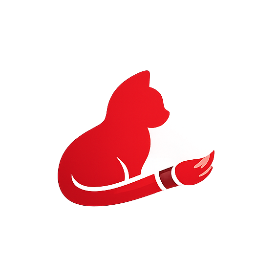
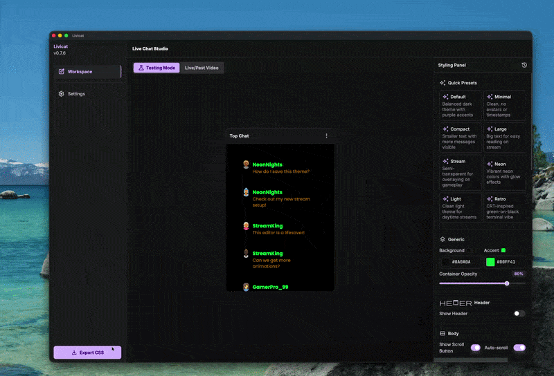
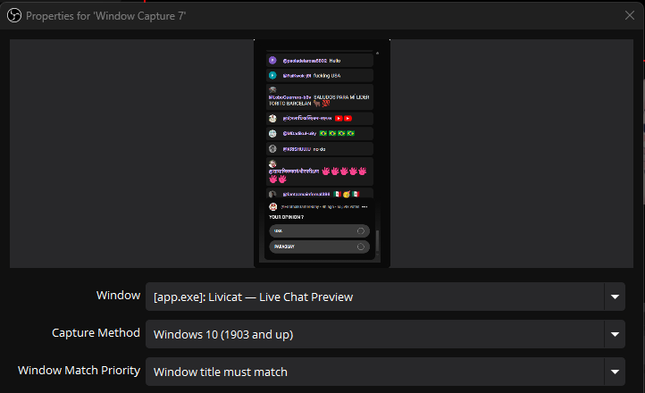

  

# Livicat — YouTube Live Chat Styling Editor for OBS

A desktop app for customizing YouTube Live Chat appearance for OBS overlays.

  

---

## 📚 Documentation

### 🎯 [For Streamers → docs/STREAMER.md](docs/STREAMER.md)
*Installation • Quick Start • OBS Setup • Customization • Troubleshooting*

### 🛠️ [For Developers → docs/README_DEVELOPER.md](docs/README_DEVELOPER.md)
*Architecture • Setup • API Reference • Testing • Contributing*

---

## ✨ Features

- 🎨 **7 Preset Themes** — Default, Minimal, Compact, Large, Stream, Neon, Light, Retro
- ✨ **6 Message Animations** — Blink, Glowing, Fade, Slide, Bounce
- 🪟 **Two OBS Methods** — CSS Export or Live Preview
- ⚡ **Real-Time Preview** — Always-on-top popup window
- 📊 **Privacy-First Analytics** — Aptabase with consent
- 🔒 **Error Reporting** — Sentry crash tracking
- 🚀 **Lightweight** — 8MB Tauri (vs 115MB Electron)

---

## 🎥 Demo Videos

**Fast Live Chat Styling:**

**OBS Integration Tutorial:**

---

## 📥 Download

🎉 **[Latest Release](https://github.com/kg20dev/livicat/releases)**

- **macOS (Apple Silicon):** `.dmg` installer
- **Windows:** `.exe` installer

---

## 🚀 Quick Start

**Streamers:** 2 minutes to custom chat → [docs/STREAMER.md](docs/STREAMER.md)

**Developers:** `git clone && npm install` → [docs/README_DEVELOPER.md](docs/README_DEVELOPER.md)

> **⚠️ Windows + OBS Live Preview (Window Capture):**  
> In OBS, open the Window Capture source properties and set **Capture Method** to **"Windows 10 (1903 and up)"** — do not leave it on "Automatic". The preview window won't update without this setting.
>
> 

---

## 📊 Stats

- **Size:** ~10MB (91% smaller than Electron)
- **Tests:** 182+ tests
- **Languages:** TypeScript, Rust, React
- **Platforms:** macOS, Windows
- **License:** MIT

---

## 🤝 Contributing

- [Report a Bug](https://github.com/kg20dev/livicat/issues/new?template=bug_report.yml)
- [Feature Request](https://github.com/kg20dev/livicat/issues/new)
- [Contributing Guide](docs/README_DEVELOPER.md#contributing)

---

## 👥 Team

**Thanks to our contributors who make Livicat better!**

**Thank you to:**

- All streamers and developers who use Livicat
- Contributors who report bugs and suggest features
- Community members who test and provide feedback
- Everyone who helps improve Livicat! 🙌

---

**Made with ❤️ for streamers** | [kg20dev](https://github.com/kg20dev)
